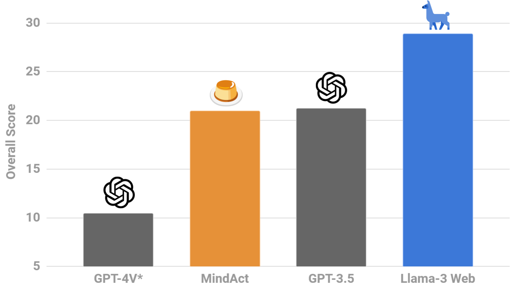

<div align="center">

<h1>🖥️ WebLlama🦙</h1>

<i>Building <b>agents</b> that can browse the web by following instructions and talking to you</i>

| 💻 [**GitHub**](https://github.com/McGill-NLP/webllama) | 🏠 [**Homepage**](https://webllama.github.io) | 🤗 [**`Llama-3-8B-Web`**](https://huggingface.co/McGill-NLP/Llama-3-8B-Web) |
| :--: | :--: | :--: |


</div>

> [!IMPORTANT] 
> **We are thrilled to release [`Llama-3-8B-Web`](https://huggingface.co/McGill-NLP/Llama-3-8B-Web), the most capable agent built with 🦙 Llama 3 and finetuned for web navigation with dialogue. You can download the agent from the 🤗 [Hugging Face Model Hub](https://huggingface.co/McGill-NLP/Llama-3-8B-Web).**

| `WebLlama` helps you build powerful agents, powered by Meta Llama 3, for browsing the web on your behalf | Our first model, [`Llama-3-8B-Web`](https://huggingface.co/McGill-NLP/Llama-3-8B-Web), surpasses GPT-4V (`*`zero-shot) by 18% on [`WebLINX`](https://mcgill-nlp.github.io/weblinx/) |
|:---: | :---: |
|  |  |

## About the project

| `WebLlama` | The goal of our project is to build effective human-centric agents for browsing the web. We don't want to replace users, but equip them with powerful assistants. |
|:---: | :---|
| Modeling | We are build on top of cutting edge libraries for training Llama agents on web navigation tasks. We will provide training scripts, optimized configs, and instructions for training cutting-edge Llamas. |
| Evaluation | Benchmarks for testing Llama models on real-world web browsing. This include *human-centric* browsing through dialogue ([`WebLINX`](https://mcgill-nlp.github.io/weblinx/)), and we will soon add more benchmarks for automatic web navigation (e.g. Mind2Web). |
| Data | Our first model is finetuned on over 24K instances of web interactions, including `click`, `textinput`, `submit`, and dialogue acts. We want to continuously curate, compile and release datasets for training better agents. |
| Deployment | We want to make it easy to integrate Llama models with existing deployment platforms, including Playwright, Selenium, and BrowserGym. We are currently focusing on making this a reality. |


## Modeling

> [!NOTE]
> The model is available on the 🤗 Hugging Face Model Hub as [`McGill-NLP/Llama-3-8B-Web`](https://huggingface.co/McGill-NLP/Llama-3-8B-Web). The training and evaluation data is available on [Hugging Face Hub as `McGill-NLP/WebLINX`](https://huggingface.co/datasets/McGill-NLP/WebLINX).

Our first agent is a finetuned [`Meta-Llama-3-8B-Instruct`](https://huggingface.co/meta-llama/Meta-Llama-3-8B-Instruct) model, which was recently released by Meta GenAI team. We have finetuned this model on the [`WebLINX`](https://mcgill-nlp.github.io/weblinx/) dataset, which contains over 100K instances of web navigation and dialogue, each collected and verified by expert annotators. We use a 24K curated subset for training the data.



**It surpasses GPT-4V (zero-shot `*`) by over 18% on the [`WebLINX`](https://mcgill-nlp.github.io/weblinx/) benchmark**, achieving an overall score of 28.8% on the out-of-domain test splits (compared to 10.5% for GPT-4V). It chooses more useful links (34.1% vs 18.9% *seg-F1*), clicks on more relevant elements (27.1% vs 13.6% *IoU*) and formulates more aligned responses (37.5% vs 3.1% *chr-F1*).

It's extremely straightforward to use the model via Hugging Face's `transformers`, `datasets` and `hub` libraries:

```python
from datasets import load_dataset
from huggingface_hub import snapshot_download
from transformers import pipeline

# We use validation data, but you can use your own data here
valid = load_dataset("McGill-NLP/WebLINX", split="validation")
snapshot_download("McGill-NLP/WebLINX", repo_type="dataset", allow_patterns="templates/*")
template = open('templates/llama.txt').read()

# Run the agent on a single state (text representation) and get the action
state = template.format(**valid[0])
agent = pipeline("McGill-NLP/Llama-3-8b-Web")
out = agent(state, return_full_text=False)[0]
print("Action:", out['generated_text'])

# Here, you can use the predictions on platforms like playwright or browsergym
action = process_pred(out['generated_text'])  # implement based on your platform
env.step(action)  # execute the action in your environment
```

## Evaluation

We believe short demo videos showing how well an agent performs is NOT enough to judge an agent. Simply put, **we do not know if we have a good agent if we do not have good benchmarks.** We need to systematically evaluate agents on wide range of tasks, spanning from simple instruction-following web navigation to complex dialogue-guided browsing. 


This is why we chose [`WebLINX`](https://mcgill-nlp.github.io/weblinx/) as our first benchmark. In addition to the training split, the benchmark has 4 real-world splits, with the goal of testing multiple dimensions of generalization: new websites, new domains, unseen geographic locations, and scenarios where the *user cannot see the screen and relies on dialogue*. It also covers 150 websites, including booking, shopping, writing, knowledge lookup, and even complex tasks like manipulating spreadsheets. Evaluating on this benchmark is very straightforward:

```bash
cd modeling/

# After installing dependencies, downloading the dataset, and training/evaluating your model, you can evaluate:
python -m weblinx.eval # automatically find all `results.jsonl` and generate an `aggregated_results.json` file

# Visualize your results with our app:
cd ..
streamlit run app/Results.py
```

> 👷‍♀️ **Next steps**\
> We are planning to evaluate our models on more benchmarks, including Mind2Web, a benchmark for automatic web navigation. We believe that a good agent should be able to navigate the web both through dialogue and autonomously, and potentially attain even broader ranges of capabilities useful for real-world web browsing.


## Data

Although the 24K training examples from [`WebLINX`](https://mcgill-nlp.github.io/weblinx/) provide a good starting point for training a capable agent, we believe that more data is needed to train agents that can generalize to a wide range of web navigation tasks. Although it has been trained and evaluated on 150 websites, there are millions of websites that has never been seen by the model, with new ones being created every day. 

**This motivates us to continuously curate, compile and release datasets for training better agents.** As an immediate next step, we will be incorporating `Mind2Web`'s training data into the equation, which also covers over 100 websites.


## Deployment

We are working hard to make it easy for you to deploy Llama web agents to the web. We want to integrate `WebLlama` with existing deployment platforms, including Microsoft's Playwright, ServiceNow Research's BrowserGym, and other partners.

At the moment, we offer the following integrations:
* `Browsergym`: Please find more information in [`examples/README.md`](examples/README.md) and [`docs/README.md`](docs/README.md).

## Code

The code for finetuning the model and evaluating it on the [`WebLINX`](https://mcgill-nlp.github.io/weblinx/) benchmark is available now. 
* **Modeling**: You can find the detailed instructions in [modeling](modeling/README.md) for training `Llama-3-8B-Web` on the `WebLINX` dataset.
* **Examples**: We provide a few example for using the `webllama` API and models, including web API, end-to-end, and BrowserGym integration. You can find them in [examples](examples/README.md).
* **App**: We provide a simple Streamlit app for visualizing the results of your model on the `WebLINX` benchmark. You can find the code in [app](app/Results.py).
* **Docs**: We provide detailed documentation for the code in [docs](docs/README.md).


> 👷‍♀️ **Next steps**\
> We are actively working on new data and evaluation at the moment! If you want to help, please create an issue describing what you would like to contribute, and we will be happy to help you get started.

## Citation

If you use `WebLlama` in your research, please cite the following paper (upon which the data, training and evaluation are originally based on):

```
@misc{lù2024weblinx,
      title={WebLINX: Real-World Website Navigation with Multi-Turn Dialogue}, 
      author={Xing Han Lù and Zdeněk Kasner and Siva Reddy},
      year={2024},
      eprint={2402.05930},
      archivePrefix={arXiv},
      primaryClass={cs.CL}
}
```

## License

The code in this repository is licensed under the MIT license, unless otherwise specified in the header of the file. Other materials (models, data, images) have their own licenses, which are specified in the original pages.

## FAQ

### How can I contribute to the project?

We are actively looking for collaborators to help us build the best Llama-3 web agents! To get started, open an issue about what you would like to contribute, and once it has been discussed, you can submit a pull request.
